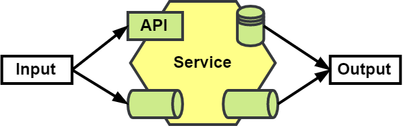
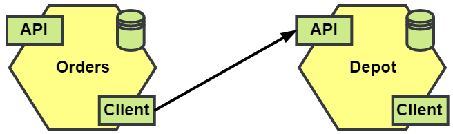
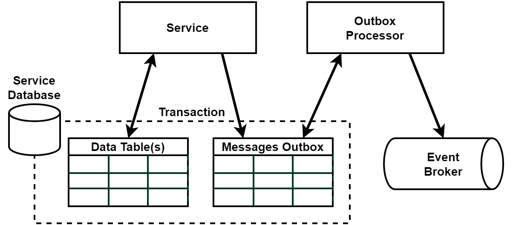
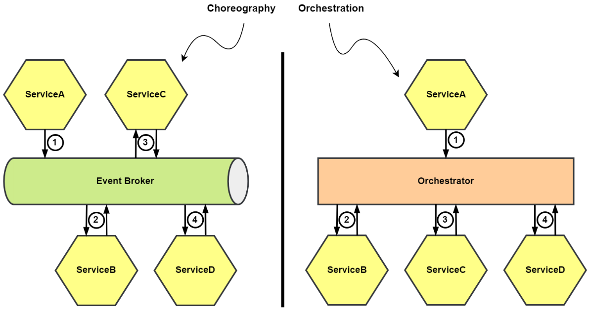

# Notas

## 1. Introdução às Arquiteturas Orientadas a Eventos

Arquiteturas orientadas a eventos são projetadas para responder a ações que ocorrem no sistema, permitindo uma comunicação assíncrona e desacoplada entre diferentes componentes.

### Padrões

Esses padrões são comuns em sistemas que utilizam eventos para processar e reagir a mudanças de estado.

- Notificações de evento: Mensagens leves que indicam que algo ocorreu, sem transportar o estado completo.
- Transferência de estado carregado por evento: Mensagens que carregam o estado alterado, permitindo que os consumidores atualizem suas visões do sistema.
- Origem de evento: Um registro imutável de eventos que permite reconstruir o estado de um sistema ou entidade.

#### Notificação de evento

- Estado mínimo: Contém apenas informações essenciais para notificar a ocorrência de um evento.
- Identificador **ID**: Um identificador único para rastrear e referenciar o evento.
- Momento exato da ocorrência: A data e hora em que o evento ocorreu.

#### Transferência de estado carregado por evento

- Modelo de transferência push: Os eventos são enviados ativamente para os consumidores.
- Identificador **ID**: Um identificador único para cada evento.
- Momento exato da ocorrência: A data e hora em que o evento ocorreu.
- Carga com as alterações de dados: Detalhes sobre o que mudou no estado do sistema.

#### Origem de evento

- Fluxos de eventos: Uma sequência de eventos que podem ser lidos e processados.
- Identificador **ID**: Um identificador único para cada evento.
- Carga com os dados: Informações completas sobre o evento e o estado associado.
- Momento exato da ocorrência: A data e hora em que o evento ocorreu.
- Recriação do estado final: A capacidade de reconstruir o estado atual a partir da sequência de eventos.

### Componentes Principais

Os componentes principais de um sistema orientado a eventos incluem o evento em si, a infraestrutura de mensagens e os atores que produzem e consomem eventos.

- Evento: Uma representação de uma ação ou ocorrência significativa no sistema.
- Fila: Um mecanismo para armazenar e transmitir eventos entre produtores e consumidores.
- Produtor: A entidade que gera e publica eventos.
- Consumidor: A entidade que escuta e reage aos eventos.

#### Evento

- É uma ocorrência que aconteceu na aplicação.
- Está no passado e é um fato imutável.
- Objetos de valor simples que contêm estado.
- É igual a outro se todos os atributos forem iguais.

#### Fila

Referida por uma variedade de termos, incluindo barramento, canal, fluxo, tópico e outros.

##### Fila de mensagens

- A falta de retenção de eventos é uma característica da fila de mensagens.
- Eventos colocados em uma fila de mensagens têm um tempo de vida limitado.
- Após terem sido consumidos ou expirado, são descartados.
- Útil para cenários simples de publicador/assinante (pub/sub).
- Cenários em que os assinantes estão em execução ativa ou podem recuperar os eventos rapidamente.

##### Fluxos de eventos

- Quando você adiciona retenção de eventos a uma fila de mensagens.
- Agora pode ler fluxos de eventos começando com o evento mais antigo.
- Pode começar a consumir novos eventos à medida que são adicionados.

##### Armazenamento de eventos

- Repositório somente para acréscimos de eventos.
- Fornecem controles de concorrência otimista.
- Não são usados para comunicação de mensagens.
- Usados em conjunto com a origem de eventos para rastrear alterações em entidades.

##### Produtores

- Publicam um evento representando a mudança na fila apropriada.
- Podem incluir metadados adicionais junto com o evento.
- Os metadados são úteis para rastreamento, desempenho ou monitoramento.
- Publicam sem saber para quem os consumidores podem estar ouvindo.

##### Consumidores

- Se inscrevem e leem eventos das filas.
- Organizados em grupos para compartilhar a carga.
- Podem ser indivíduos lendo todos os eventos conforme são publicados.
- Ler de fluxos pode optar por ler desde o início.

### Organizando a Aplicação

A organização da aplicação em torno de eventos permite uma arquitetura flexível e responsiva.

#### Serviços de Aplicação

- Usam eventos para comunicar novos estados.
- Acionadores e notificações.
- Publicam e se inscrevem neles.

#### Serviços de gateway de API

- API RESTful.
- Websocket.
- gRPC.
- Implementados como um padrão BFF (Backends for Frontends).

#### Clientes

- Aplicação de Página Única (SPA).
- Aplicação Móvel.
- Integração de API.

#### Nota sobre hexágonos

Os serviços na Figura têm algumas combinações de comunicação ou conexões síncronas e assíncronas, e todos são desenhados como hexágonos, conforme mostrado no seguinte diagrama:

Em uma conexão P2P, como mostrado no diagrama a seguir, o componente chamador, Pedidos, depende do componente chamado, Depósito, usando um `Cliente` para fazer a comunicação.

### Desafios

Alguns desafios que devem ser superados para o sucesso da aplicação.

#### Consistência eventual

- Mudanças no estado da aplicação podem não estar imediatamente disponíveis.
- Consultas podem produzir resultados desatualizados até que a mudança tenha sido totalmente registrada.
- Uma aplicação assíncrona pode ter que lidar com a consistência eventual.

#### Escritas duplas

- Refere-se a qualquer momento em que você está alterando o estado da aplicação em dois ou mais lugares durante uma operação.
- Fazendo uma alteração local em um banco de dados e então estamos publicando um evento sobre o evento ou o evento em si.
- Solução que nos fará publicar nossos eventos no banco de dados ao lado do resto das alterações para manter a mudança de estado atômica.

#### Fluxos de trabalho distribuídos e assíncronos

- Realizando fluxos de trabalho complexos entre componentes usando eventos.
- Tornando o fluxo de trabalho totalmente assíncrono.
- O componente pode não ter o estado final da aplicação quando consultado.

#### UX

- Difícil retornar um resultado final para o usuário.
- As soluções incluem, mas não se limitam a:
  - Polling no cliente.
  - Entregando o resultado de forma assíncrona usando WebSockets.
  - Criando a expectativa de que o usuário deve verificar posteriormente o resultado.

#### Colaboração de componentes

- **Coreografia:** Os componentes conhecem individualmente o trabalho que devem fazer e qual é o próximo passo.
- **Orquestração:** Os componentes sabem muito pouco sobre seu papel e são chamados para fazer sua parte por um orquestrador centralizado.

#### Depurabilidade

Na comunicação síncrona ou P2P envolve um chamador e um chamado, sempre sabendo o que foi chamado e o que fez a chamada.

- Publicar um evento e não necessariamente saber se algo está consumindo.
- Desafio em rastrear uma operação entre os componentes da aplicação.
