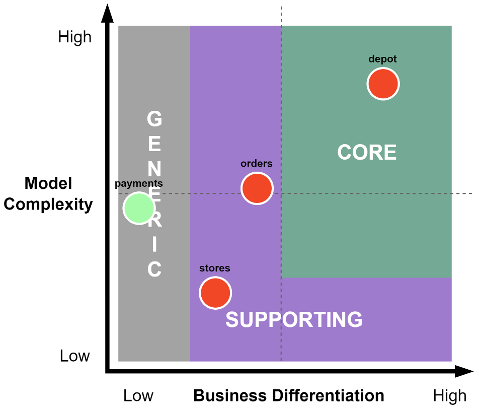

# Notes

## 2. Supporting Patterns in Brief

Patterns that work together with EDA to support excellent event-driven application design and development

- Domain-driven design
- Domain-centric architectures
- Command and Query Responsibility Segregation
- Application architectures

### Domain-driven design

Taking a high-level look at the key strategic patterns that are useful to us as we design and develop event-driven applications.

- DDD is a set of coding patterns
- DDD is enterprise-level or leads to overengineered applications
- DDD does not force you or your team to utilize a specific architecture, pattern, or code structure
- DDD is about modeling a complex business idea into software by developing a deep understanding of the problem domain
- The two key patterns of DDD at play here are the ubiquitous language and bounded contexts
- The Ubiquitous Language (UL) principle requires every domain-specific term to have a single meaning within a bounded context

#### Tackling the complexity

The complexity of the problem domain can be reduced by breaking the domain into subdomains so that we're dealing with more manageable chunks of the problem. Each new domain we identify falls into one of three types:

- **Core domains:** Critical components of the application that are unique or provide a competitive advantage to the business. These get the most focus, the most money, and the best developers. A core domain is not always obvious and can evolve or change with the business.

- **Supporting domains:** The utility components that provide functionality that supports the core business. You might consider using an off-the-shelf solution if what is being provided and developed by a team is not specific enough to the business.

- **Generic domains:** Components that are unrelated to the core business but necessary for it to function. Email, payment processing, reporting, and other common commodity solutions fall into this domain type. It wouldn't make sense to devote teams to develop this functionality when so many solutions exist.

#### Modeling

- **Domain model** is a product of the collaboration between domain experts and developers using the `UL(Ubiquitious Language)`
- should be limited to the data and behaviors that are relevant to the problem domain
- the point of a domain model is to solve problems identified in the domain
- should be free of any technical complexities or concerns

#### Defining boundaries

Every model belongs to a bounded context, which is a component of the application.

- broken down the complexity into multiple domains
- discovered the models hidden within your software
- we see forming from our discovery efforts will be around the business capabilities
- All the domains should not have a singular view of any given model
- should be concerned with the parts that are relevant to a particular bounded context

**Examples:**

- Order management
- Payment processing
- Depot operations
- Store inventory management
